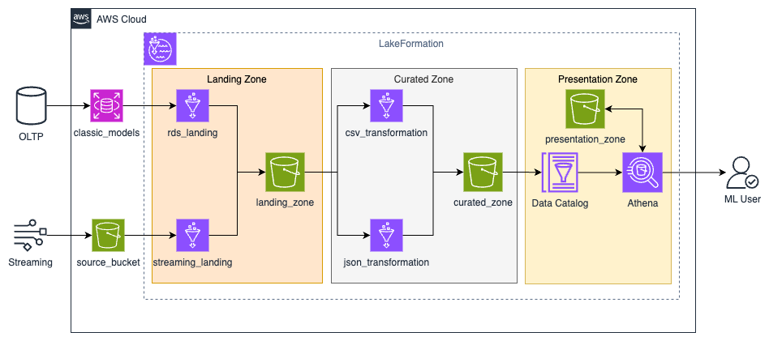

<div align="center">
  
# 🏗️ AWS Governed Data Lakehouse

**Secure, Scalable Analytics with Lake Formation & Apache Iceberg**

A governed data lakehouse on AWS that ingests operational data from multiple sources, transforms it through medallion-architecture zones (Landing → Curated → Presentation), and enforces fine-grained access control with Lake Formation all backed by Apache Iceberg for ACID transactions and schema evolution.

[](https://www.terraform.io/)
[](https://aws.amazon.com/cloudformation/)
[](https://aws.amazon.com/)
[](https://aws.amazon.com/lake-formation/)
[](https://iceberg.apache.org/)
[](https://aws.amazon.com/glue/)
[](https://aws.amazon.com/athena/)
[](https://opensource.org/licenses/MIT)

</div>

## 💡 Problem Statement

Organizations need to decouple analytical workloads from production OLTP databases while maintaining strict data governance. Running ad-hoc queries directly on transactional systems degrades performance, and opening up data lake access without governance creates compliance and security risks.

### **This project solves both problems by implementing:**

1. **Governed Data Lakehouse** — A three-zone architecture (Landing → Curated → Presentation) where every resource is governed by **AWS Lake Formation** with tag-based access control (TBAC), ensuring only authorized roles and users access specific data.

2. **ACID-Compliant Table Format** — **Apache Iceberg** tables registered with the AWS Glue Catalog enable MERGE INTO upserts, schema evolution (ALTER TABLE ADD COLUMNS), and time-travel queries — going beyond immutable Parquet-on-S3.

3. **Role-Separated Access** — Distinct IAM roles for Lake Formation registration, data lake administration, Glue ETL execution, and ML consumer access — enforcing the principle of least privilege at every layer.

## 🏛️ Architecture



### End-to-End Data Flow:

The system ingests data from two sources — an **RDS MySQL** transactional database (batch CSV) and a **streaming JSON** source (ratings data). Both flows land in the **Landing Zone** on S3, are transformed by **AWS Glue PySpark** jobs with schema enforcement and metadata enrichment into the **Curated Zone**, and surface as Iceberg tables registered in the **Glue Catalog** for **Athena** queries — all governed by **Lake Formation** permissions.

## 📁 Project Structure

```
aws-governed-lakehouse/
│
├── infrastructure/
│   └── template.yaml              # CloudFormation — VPC, RDS, S3, Lake Formation,
│                                   #   Athena, IAM roles, Iceberg Lambda setup
│
├── terraform/
│   ├── main.tf                    # Root module: landing → transform → schema evolution
│   ├── variables.tf / outputs.tf / backend.tf
│   └── modules/
│       ├── landing-etl/           # Glue connection + RDS & JSON ingestion jobs
│       ├── transform-etl/         # Curated zone transforms + Iceberg writes
│       └── schema-evolution/      # ALTER TABLE Iceberg column operations
│
├── etl/
│   ├── landing/
│   │   ├── batch_ingress.py       # RDS MySQL → S3 Landing Zone (8 tables)
│   │   └── json_ingress.py        # S3 JSON ratings → Landing Zone
│   ├── transform/
│   │   ├── batch_transform.py     # Schema enforcement + metadata enrichment → Curated
│   │   ├── json_transform.py      # Ratings + Products + Customers → Iceberg ML features
│   │   └── ratings_to_iceberg.py  # MERGE INTO Iceberg upserts
│   └── evolution/
│       └── alter_ratings_table.py # Iceberg ALTER TABLE ADD COLUMNS
│
├── governance/
│   └── lf_utils.py                # Lake Formation permission grant utilities
│
├── scripts/
│   └── setup.sh                   # Environment bootstrap & TF variable export
│
├── images/
│   └── architecture.png           # Three-zone lakehouse diagram
│
├── .gitignore
└── LICENSE
```

## 🔄 Data Zones

| Zone | Purpose | Format | Governance |
|------|---------|--------|------------|
| **Landing** | Raw ingestion from sources (no transformation) | CSV, JSON | LF data location access |
| **Curated** | Schema-enforced, metadata-enriched, deduplicated | Parquet (Snappy), Iceberg | LF database + table grants |
| **Presentation** | Analytics-ready views for consumers | Iceberg tables via Glue Catalog | LF tag-based access control (TBAC) |

## 🚀 Getting Started

### Prerequisites

- **Terraform** ≥ 1.0
- **AWS CLI** v2 (configured with appropriate IAM permissions)
- **MySQL** client (for seed data verification)
- **Python** 3.8+

### 1. Deploy the Infrastructure

```bash
aws cloudformation deploy \
  --template-file infrastructure/template.yaml \
  --stack-name gov-lakehouse \
  --capabilities CAPABILITY_NAMED_IAM \
  --parameter-overrides \
      DatabaseUserPassword=<YOUR_DB_PASSWORD> \
      MLDatalakeUserPassword=<YOUR_ML_USER_PASSWORD> \
      AssetsBucketName=<YOUR_ASSETS_BUCKET>
```

### 2. Bootstrap Terraform Variables

```bash
# Set credentials securely via environment variables
export DB_USERNAME=<your_username>
export DB_PASSWORD=<your_password>

source scripts/setup.sh
```

### 3. Deploy ETL Pipelines

```bash
cd terraform
terraform init && terraform plan && terraform apply
```

### 4. Run the ETL Pipeline

```bash
# 1. Ingest from RDS MySQL → Landing Zone
aws glue start-job-run --job-name gov-lakehouse-rds-ingestion-etl-job

# 2. Ingest from JSON source → Landing Zone
aws glue start-job-run --job-name gov-lakehouse-bucket-ingestion-etl-job

# 3. Transform to Curated Zone (schema enforcement + metadata)
aws glue start-job-run --job-name gov-lakehouse-csv-transformation-job

# 4. Build ML features and write to Iceberg
aws glue start-job-run --job-name gov-lakehouse-ratings-transformation-job

# 5. MERGE INTO Iceberg (upsert ratings)
aws glue start-job-run --job-name gov-lakehouse-ratings-to-iceberg-job
```

### 5. Query with Athena

```sql
-- Query the governed Iceberg table via Athena
SELECT * FROM curated_zone.ratings LIMIT 10;

-- Time-travel query (Iceberg V2 feature)
SELECT * FROM curated_zone.ratings FOR SYSTEM_VERSION AS OF <snapshot_id>;
```

## 🔑 Key Design Decisions

| Decision | Rationale |
|----------|-----------|
| **Lake Formation over IAM-only** | LF provides fine-grained column/row-level access, tag-based access control (TBAC), and centralized governance — impossible with IAM policies alone |
| **Apache Iceberg V2** | ACID transactions, MERGE INTO upserts, schema evolution (ADD COLUMNS), and time-travel critical for a lakehouse vs. a plain data lake |
| **Tag-Based Access Control** | LF-Tags enable scalable, policy-driven governance: tag resources once, control access for all consumers via tag expressions |
| **Modular Terraform** | Three composable modules (`landing-etl`, `transform-etl`, `schema-evolution`) with explicit `depends_on` ordering for safe sequential deployment |
| **Parquet + Snappy** | Columnar storage with compression for cost-efficient Athena queries (pay-per-scan) |
| **Role Separation** | Distinct roles for LF Registration, Data Lake Admin, Glue ETL, and ML Consumer principle of least privilege at every layer |
| **Secrets Manager** | ML user credentials stored in Secrets Manager instead of hardcoded values; DB passwords injected via CloudFormation NoEcho parameters |
| **Dual IaC** | CloudFormation for infrastructure baseline (VPC, RDS, LF, IAM) + Terraform for ETL orchestration leveraging each tool's strength |

## 🧊 Iceberg Capabilities Used

| Feature | Where | Purpose |
|---------|-------|---------|
| **MERGE INTO** | `ratings_to_iceberg.py` | Upsert ratings — update existing, insert new |
| **Schema Evolution** | `alter_ratings_table.py` | `ALTER TABLE ADD COLUMNS` without rewriting data |
| **Partitioned Writes** | `json_transform.py` | Partition by `country` for optimized Athena queries |
| **Format Version 2** | All Iceberg writes | Enables row-level deletes and position-based merges |
| **Gzip Compression** | Iceberg write options | `write.parquet.compression-codec: gzip` for storage efficiency |

## 📝 License

This project is licensed under the **MIT License**. See the [LICENSE](LICENSE) file for details.

> ### 🌟 Contributions Welcome  
> Built with ❤️ on AWS to make governed data analytics feel effortless.
